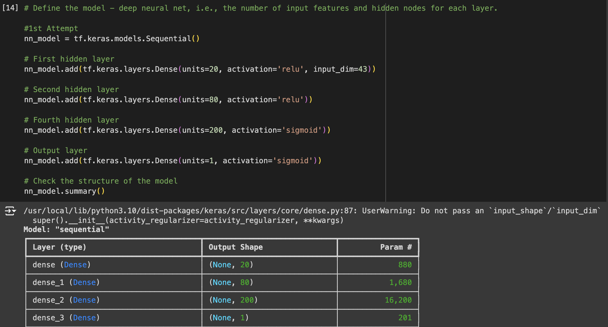

# deep-learning-challenge

__Instructions__

The nonprofit foundation Alphabet Soup wants a tool that can help it select the applicants for funding with the best chance of success in their ventures. With your knowledge of machine learning and neural networks, you’ll use the features in the provided dataset to create a binary classifier that can predict whether applicants will be successful if funded by Alphabet Soup.

From Alphabet Soup’s business team, you have received a CSV containing more than 34,000 organizations that have received funding from Alphabet Soup over the years. Within this dataset are a number of columns that capture metadata about each organization, such as:

* EIN and NAME—Identification columns
* APPLICATION_TYPE—Alphabet Soup application type
* AFFILIATION—Affiliated sector of industry
* CLASSIFICATION—Government organization classification
* USE_CASE—Use case for funding
* ORGANIZATION—Organization type
* STATUS—Active status
* INCOME_AMT—Income classification
* SPECIAL_CONSIDERATIONS—Special considerations for application
* ASK_AMT—Funding amount requested
* IS_SUCCESSFUL—Was the money used effectively

__Load Model__
Run the following code in a colab notebook:

`loaded_model = tf.keras.models.load_model('AlphabetSoupCharity_Optimization.h5')`

# __Neural Network Model Report__

__Purpose__

* The purpose of this analysis is to go through the features in the Alphabet Soup's dataset and determine a model that can best predict whether applicants who are funded will be successful if funded. As a venture, it is important to take informed investments and leverageing a neural network model that can mitigate loss is a key strategy for this analysis.

__Data Preprocessing__

* What variable(s) are the target(s) for your model?
    * The target for this model was the `IS_SUCCESSFUL` column

* What variables(s) are the features for your model?
    * The following were the features: `APP_TYPE, AFFILIATION, CLASSIFICATION, USE_CASE, ORGANIZATION, STATUS, INCOME_AMT, SPECIAL_CONSIDERATION, ASK_AMT`

* What variable(s) should be removed from the input data because they are neither targets nor features?
    * `EIN` & `NAME` were removed as neither features nor targets

__Compiling, Training, and Evaluating the Model__
* How many neurons, layers, and activation functions did you select for your neural network model, and why?
    * I ended up with a model that contains 4 layers. The first layer was a relu activation & 40 neurons. The second was also a relu with 90 neurons. The third layers was a relu activation along with 110 neurons, my last layer was 50 neurons with a sigmoid activation. My Training model ran 75 epochs.

    * There was a variety of experimentation when coming to this final layout. This includes two other attempts with different layer & neuron amounts that will be attached below. I chose relu as the main activation as it has been stated as one commonly used in the field. This did not stop me from experiementing with other activations including Tanh & LeakRelu. Although interesting to setup, the useage yielded little benefits to my accuracy. I saw the best accuracy when using relu & sigmoid which is why I chose those as the final activations. There was a wide variety of experimentation in epochs from 20, 30, 100, to 200. None seemed to differe too much as my model seemed to always flatten at around 72%.

    * Image 1 - First Attempt  

    * Image 2 - Second Attempt 

    * Image 3 - Final Attempt 

    * Were you able to achieve the target model performance
        * After much training & experimentation, I was unfortunately unable to achieve the target accuracy of 75% or better. The best accuracy results that I pulled was model 1 that produced an accuracy of 0.7265

    * What steps did you take in your attempts to increase model performances? 
        * Aside from the already mentioned steps of utilizing different activation models & neurons I also attempted to debug using callback to potentially find the optimal number of epochs. I also attempted to drop a couple of features to see if it would yield better results. I dropped the `AFFILIATION` & `CLASSIFICATION` for testing. At one point I dropped one of them and at another point I dropped both. It was hard determining which features were optimal to keep without having gone through a PCA or Random Forest process. Dropping these was just an attempt based on guessing, neither produced positive results, in actuality when the features were dropped accuracy also dropped below 70% & into the 60s.
    
__Summary__

* Overall it seems like the best results were my first attempt shown on Image 1. This included an activation layer with 20 neurons & relu activation, a second layer with 80 neurons & a relu activation, and lastly a layer with 200 neurons & a sigmoid activation.
*  I mentioned this before but I think I would improve my model in the future by either appying a PCA model or Random Forest model to this data during the cleaning & identification of features process. This would help by identifying the best features that could be used and hopefully optimize my model to increase accuracy and decrease loss. This would mean that less features are used and a better target would be ran from my X & y.